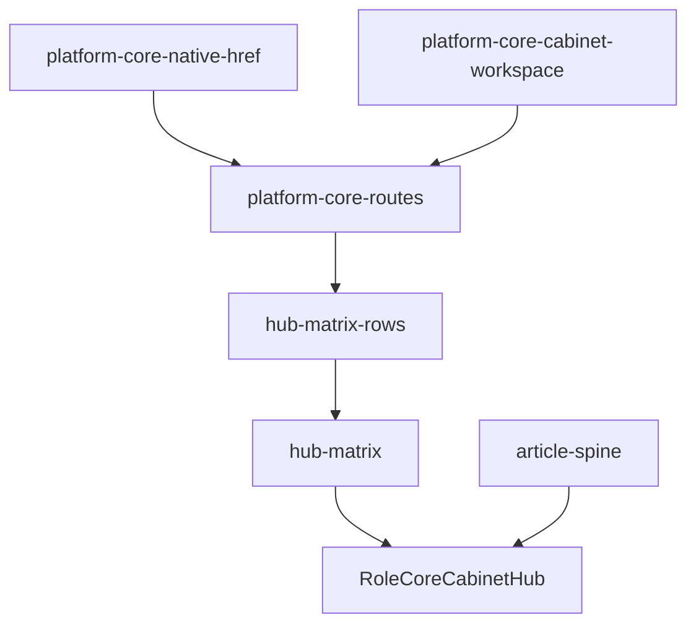
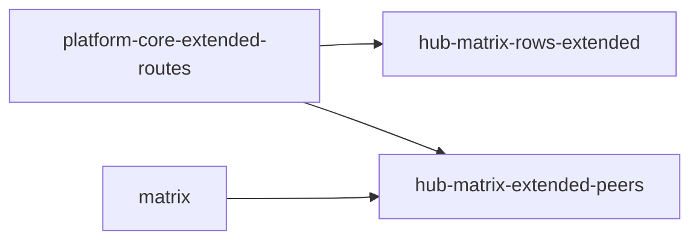

# Platform Core Dependency Graph

**Generated:** 2026-07-08 · Phase 18

## Layers

| Layer | Modules | Rule |
|-------|---------|------|
| 🟢 Core | `platform-core-routes`, `hub-matrix-rows`, `hub-matrix`, `article-spine`, `/brand/core`, `/shop/core` | No `@/lib/routes`, no factory static imports |
| 🟡 Supporting | `platform-core-native-href`, `platform-core-cabinet-workspace`, BFF under `app/api/platform-core/` | May use `legacy-routes` for redirects only |
| 🟠 Extended | `platform-core-extended-routes`, `hub-matrix-rows-extended`, `components/platform/extended/*` | Factory/supplier; gated by `NEXT_PUBLIC_PC_EXTENDED_ROLES` |
| 🔵 Archive | `platform-core-legacy-routes`, `_archive/*` stubs, wave7/wave9 archive lists | Middleware + compatibility only |

## Core → Supporting edges (sample)

## Extended isolation

## Remaining baseline violations (static import audit)

- None in strict core file list ✅

## Factory static imports in `components/platform` (bundle risk)

- `components/platform/CommsPillarCard.tsx`
- `components/platform/DevelopmentPillarCard.tsx`
- `components/platform/FactoryDossierCoreChrome.tsx`
- `components/platform/OrderProductionPillarCard.tsx`
- `components/platform/SupplierBomPreview.tsx`
- `components/platform/SupplierProcurementPillarCard.tsx`
- `components/platform/empty-cells/supplier-collection-order-forecast-panel.tsx`
- `components/platform/workspaces/SupplierDevelopmentCabinetWorkspace.tsx`

## Cycles to watch

- `platform-core-routes` ↔ `platform-core-native-href` (checkout/matrix native href) — acceptable, both baseline
- `hub-matrix` → `hub-matrix-extended-peers` → `extended-routes` — extended peer logic isolated in separate module ✅
- Readiness audits → `platform-core-readiness-routes` bridge (no `@/lib/routes`) ✅

## Recommended next splits

1. Dynamic-import pillar cards (`CommsPillarCard`, `OrderProductionPillarCard`, `DevelopmentPillarCard`) when `roleId ∈ {manufacturer, supplier}`
2. Move archive peer strips (`BrandSc*RetailPeerStrip`) to lazy `components/platform/archive-stubs/`
3. Split `platform-core-nav-augment.ts` extended sections behind `PC_EXTENDED_ROLES`
